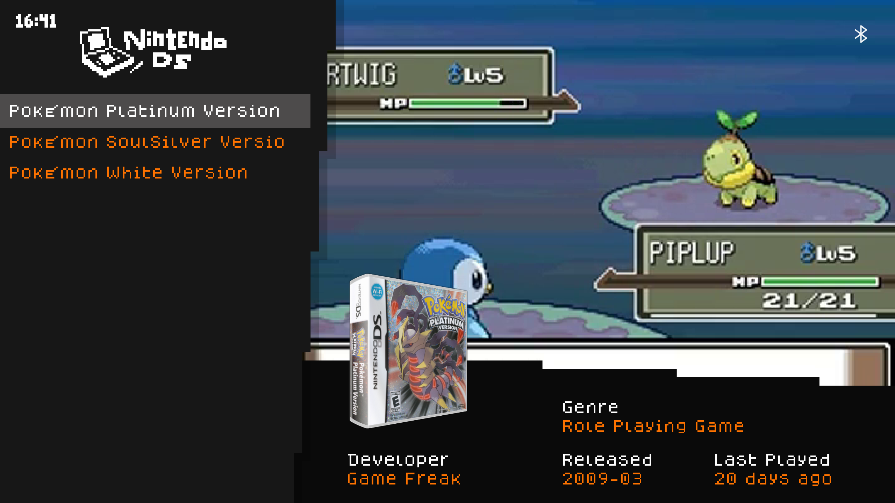

# A fork of the [TechDweeb](https://github.com/anthonycaccese/techdweeb-es-de) ES-DE theme

Changed according to my personal preferences.  
Original ReadMe is below.  

## Changes

- Made video start immediately and repeat indefinitely
- Enabled the clock in the top left
- Lowered the delay before selected game name starts scrolling horizontally to 1 second
- Removed "rating" and "player count" metadata fields
- Moved "genre" metadata field to where "rating" used to be and extended the value length
- (All metadata changes have been adapted to all aspect ratios)
- Moved video origin to top-middle (see below)
- Added new variant: Textlist with video and 3D box

## Video headaches
I've moved to video crop origin to top-middle so Nintendo DS games now display the top screen in the video area and there is less awkward UI cutoff in general. However, this is still not ideal, as it now sucks for games that use the bottom screen as main (Zelda: Phantom Hourglass for example) and many old sidescrollers where most of the action is on the bottom of the screen (Super Mario Bros., Castlevania, etc.).  
Ideally, the gamelist should be moved to the right side, metadata to the top and video to bottom left. I *might* do that someday, though it requires a bit more work than what I've already done.



---
# TechDweeb (ES-DE Version)

> Of all the Emulation Station themes you could have downloaded, you chose this one. I hope you're proud of yourself. - [TechDweeb](https://youtube.com/techdweeb)

## **Preview**

| System View | Gamelist View |
|----|----|
|  |  |

## **Features**

- Custom TD Background artwork
- 9 unique colour schemes to choose from (and the ability to define your own)
- System icons for all the popular systems
- Custom fonts and interface design
- Detailed gameslist view with pixel-riffic overlay
- Grid view with overlay
- Font size options
- Game box or logo thumbnail style
- Aspect ratio correction for ultrawide displays
- "That's all you get. More than you deserve, to be honest." - [TechDweeb](https://youtube.com/techdweeb)


## **Configuration Options**

- The theme has a simple set of options that can be changed directly from the UI Settings menu of ES-DE 
- `Theme Variant` - sets the layout used for the gamelist view when media & metadata are scraped for your games.  There are 6 variants to choose from:
   - `List: Metadata, Screenshot &amp; Marquee` - A list view that displays game screenshots, marquees and additional metadata (genre, release date, etc...)
   - `List: Metadata, Screenshot &amp; Boxart` - Same structure as above but it displays boxart instead of marquee
   - `List: Screenshot` - A simple list that removes all gamemetadata and displays only a game's screenshot
- `Theme Color Scheme` - sets the color scheme and system artwork that is used for the overall theme on all views.
- `Theme Font Size` - allows you to select between `Small`, `Medium` amd `Large` font sizes
- `Theme Aspect Ratio` - sets the aspect ratio the theme will render at. If needed, this can be changed to match the aspect ratio of your screen (though it should happen automatically).
   - 16:9, 16:10, 4:3, 3:2, 19.5:9, 21:9 and 1:1 are supported

## **Additional Notes**

### **Creating your own color scheme:**

1) In the resources folder you will find a template file called [colors-custom.xml](https://github.com/anthonycaccese/techdweeb-es-de/blob/main/resources/colors-custom.xml)

2) Make a folder named `theme-customizations` and place a copy of the `colors-custom.xml` file inside that folder.  The folder structure should look like this when you are done:
   ```
   /ES-DE/themes/techdweeb-es-de/theme-customizations/colors-custom.xml
   ```
   *Note: This structure will allow you to continue to get updates for the theme from the theme downloader while also retaining your customizations.*

3) Edit the properites in `colors-custom.xml` to create your custom color scheme:
    
4) Set the `Theme Color Scheme` in ES-DE's UI Settings menu to `Custom Choas` and you should see your custom color scheme display.  If you see an error check that the paths discussed above are correct and then check that the values you added for each property are correct and well formatted.

### Versions for other ES forks:
- If you use Batocera... then check out the version [here](https://github.com/TechDweeb/techdweeb/).  The Batocera version has all the same base features but simply makes them available to change through Batocera's menu UI.  It also adds some additional features such as the theming of the menu and the ability to toggle on/off the display of different media elements directly through the menu ui as well.

## **Credits**
- All artwork designed and created by [TechDweeb](https://youtube.com/techdweeb)
- Dogica font created by [Roberto Mocci](https://www.dafont.com/roberto-mocci.d8882)
- DWB_Title font made by JWG.LLC
- Sounds effects created by [Roetaka](https://www.youtube.com/@-roetaka)
- XML and theme build by [Ant](https://github.com/anthonycaccese)

## **License**
Creative Commons CC-BY-NC-SA - https://creativecommons.org/licenses/by-nc-sa/2.0/
You are free to share and adapt this theme as long as you provide attribution back to me (and the above credits) as well share any updates you make under the same licence terms.
